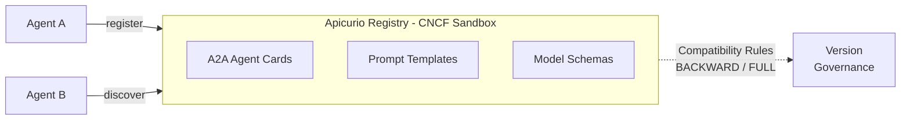

# AI Agent Discovery and Registry — Demo Walkthrough

This walkthrough accompanies the **agent-discovery** talk. It demonstrates how Apicurio Registry manages AI-native artifact types — A2A Agent Cards, prompt templates, and model schemas — enabling agent discovery, versioning, and compatibility enforcement.

## Architecture



## Prerequisites

1. Docker and Docker Compose
2. `curl` and `jq`
3. Java 21+ and Maven (for the model-metadata service)


## Step 1: Start Apicurio Registry

```bash
docker run -d --name apicurio-registry \
  -p 8080:8080 \
  quay.io/apicurio/apicurio-registry:3.2.0

# Wait for it to be ready
until curl -s http://localhost:8080/health | grep -q '"status":"UP"'; do sleep 2; done
echo "Registry is ready"
```

**Demo point:** Open http://localhost:8080 — show the Apicurio Registry UI. This is the same registry used for Avro/Protobuf/OpenAPI schemas, now extended with AI-native artifact types.


## Step 2: Register an A2A Agent Card

An A2A Agent Card describes an agent's capabilities using the Agent-to-Agent Protocol:

```bash
# Register an agent card for a "Summarizer Agent"
curl -X POST "http://localhost:8080/apis/registry/v3/groups/ai-agents/artifacts" \
  -H "Content-Type: application/json" \
  -H "X-Registry-ArtifactId: summarizer-agent" \
  -H "X-Registry-ArtifactType: JSON" \
  -d '{
    "name": "Summarizer Agent",
    "description": "Summarizes long documents into concise abstracts",
    "url": "https://agents.internal/summarizer",
    "version": "1.0.0",
    "capabilities": {
      "streaming": true,
      "pushNotifications": false
    },
    "skills": [
      {
        "id": "summarize-text",
        "name": "Text Summarization",
        "description": "Produces a concise summary of input text",
        "inputModes": ["text"],
        "outputModes": ["text"]
      }
    ],
    "defaultInputModes": ["text"],
    "defaultOutputModes": ["text"]
  }'

# Register a second agent
curl -X POST "http://localhost:8080/apis/registry/v3/groups/ai-agents/artifacts" \
  -H "Content-Type: application/json" \
  -H "X-Registry-ArtifactId: translator-agent" \
  -H "X-Registry-ArtifactType: JSON" \
  -d '{
    "name": "Translator Agent",
    "description": "Translates text between languages",
    "url": "https://agents.internal/translator",
    "version": "1.0.0",
    "capabilities": {
      "streaming": true,
      "pushNotifications": false
    },
    "skills": [
      {
        "id": "translate-text",
        "name": "Text Translation",
        "description": "Translates text from one language to another",
        "inputModes": ["text"],
        "outputModes": ["text"]
      }
    ],
    "defaultInputModes": ["text"],
    "defaultOutputModes": ["text"]
  }'
```

**Demo point:** Show both agents in the Registry UI under the `ai-agents` group. This is agent discovery — any agent in the system can query the registry to find agents by capability.


## Step 3: Agent Discovery via Registry API

Show how agents discover each other:

```bash
# List all registered agents
curl -s "http://localhost:8080/apis/registry/v3/groups/ai-agents/artifacts" | jq

# Discover a specific agent's capabilities
curl -s "http://localhost:8080/apis/registry/v3/groups/ai-agents/artifacts/summarizer-agent/versions/1/content" | jq

# Search agents by name
curl -s "http://localhost:8080/apis/registry/v3/search/artifacts?groupId=ai-agents&name=Translator" | jq
```

**Demo point:** This replaces ad-hoc service discovery. Instead of hardcoding agent URLs, agents query the registry to find peers — just like microservices use a service registry, but for AI agent capabilities.


## Step 4: Register and Version Prompt Templates

Show how prompt templates are stored as versioned artifacts with compatibility rules:

```bash
# Register a system prompt template (version 1)
curl -X POST "http://localhost:8080/apis/registry/v3/groups/prompts/artifacts" \
  -H "Content-Type: application/json" \
  -H "X-Registry-ArtifactId: summarizer-system-prompt" \
  -H "X-Registry-ArtifactType: JSON" \
  -d '{
    "template": "You are a summarization assistant. Summarize the following text in {{max_sentences}} sentences.\n\nText: {{input_text}}\n\nSummary:",
    "variables": {
      "max_sentences": {"type": "integer", "default": 3},
      "input_text": {"type": "string", "required": true}
    },
    "metadata": {
      "model": "llama3.2",
      "temperature": 0.3,
      "version": "1.0.0"
    }
  }'

# Enable BACKWARD compatibility rule
curl -X POST "http://localhost:8080/apis/registry/v3/groups/prompts/artifacts/summarizer-system-prompt/rules" \
  -H "Content-Type: application/json" \
  -d '{"ruleType": "COMPATIBILITY", "config": "BACKWARD"}'

echo "Compatibility rule enabled"
```

**Demo point:** The prompt template is now version-controlled. The BACKWARD compatibility rule means new versions must remain compatible — you can add variables but not remove required ones.

### Demonstrate a Compatible Update

```bash
# Version 2: Add an optional variable (compatible change)
curl -X POST "http://localhost:8080/apis/registry/v3/groups/prompts/artifacts/summarizer-system-prompt/versions" \
  -H "Content-Type: application/json" \
  -d '{
    "template": "You are a summarization assistant. Summarize the following text in {{max_sentences}} sentences. Use a {{tone}} tone.\n\nText: {{input_text}}\n\nSummary:",
    "variables": {
      "max_sentences": {"type": "integer", "default": 3},
      "input_text": {"type": "string", "required": true},
      "tone": {"type": "string", "default": "neutral"}
    },
    "metadata": {
      "model": "llama3.2",
      "temperature": 0.3,
      "version": "2.0.0"
    }
  }'
```

**Demo point:** This succeeds because adding an optional variable (`tone` with a default) is backward compatible. Existing agents using version 1 won't break.


## Step 5: Model Schema Validation

Use the model-metadata service to validate ML model metadata against a registered schema:

```bash
# Start the model-metadata validation service (from the model-metadata repo)
# In a separate terminal:
docker run -d --name apicurio-registry -p 8080:8080 quay.io/apicurio/apicurio-registry:3.2.0

# Register the model metadata schema
curl -X POST "http://localhost:8080/apis/registry/v3/groups/mcp-models/artifacts" \
  -H "Content-Type: application/json" \
  -H "X-Registry-ArtifactId: model-context-schema" \
  -H "X-Registry-ArtifactType: JSON" \
  -d @model-context-schema.json

# Submit a valid model
curl -X POST http://localhost:8081/models \
  -H "Content-Type: application/json" \
  -d '{
    "name": "summarizer-model",
    "version": "1.0.0",
    "framework": "pytorch",
    "artifactUri": "s3://models/summarizer/v1.safetensors",
    "createdAt": "2026-04-01T10:00:00Z",
    "metrics": {"accuracy": 0.94, "f1_score": 0.91}
  }'

# Submit an invalid model — missing required fields
curl -X POST http://localhost:8081/models \
  -H "Content-Type: application/json" \
  -d '{
    "name": "broken-model",
    "framework": "tensorflow",
    "artifactUri": 12345
  }'
```

**Demo point:** The registry validates model metadata against the schema. Invalid submissions (wrong types, missing required fields) are rejected with detailed error messages. This prevents broken model metadata from entering your AI pipeline.


## Step 6: Show Version History

```bash
# List all versions of the prompt template
curl -s "http://localhost:8080/apis/registry/v3/groups/prompts/artifacts/summarizer-system-prompt/versions" | jq

# Get version 1 (original)
curl -s "http://localhost:8080/apis/registry/v3/groups/prompts/artifacts/summarizer-system-prompt/versions/1/content" | jq

# Get version 2 (with tone variable)
curl -s "http://localhost:8080/apis/registry/v3/groups/prompts/artifacts/summarizer-system-prompt/versions/2/content" | jq
```

**Demo point:** Every prompt template change is versioned. Teams can pin to a specific version, gradually migrate, and roll back if a new prompt degrades quality.


## Key Talking Points

1. **Same tool, new artifacts** — Apicurio Registry already manages Avro, Protobuf, and OpenAPI schemas. A2A Agent Cards, prompt templates, and model schemas are just new artifact types in the same governance framework.
2. **Agent discovery** — Instead of hardcoded service URLs, agents query the registry to find peers by capability. This is the A2A Protocol's discovery mechanism backed by registry semantics.
3. **Prompt governance** — Prompt templates are version-controlled with compatibility rules. Adding a variable is a compatible change; removing one breaks downstream agents.
4. **Schema registry principles apply to AI** — Versioning, compatibility checking, and lifecycle management are the same patterns whether you're governing Kafka schemas or AI agent contracts.
5. **CNCF sandbox** — Apicurio Registry is a CNCF sandbox project, aligning AI governance with the cloud-native ecosystem.
