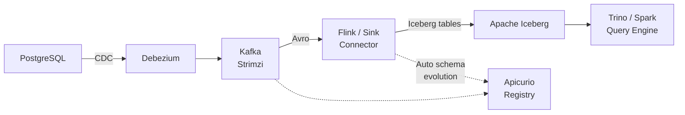

# From Database to Lakehouse in Real-Time — Demo Walkthrough

This walkthrough accompanies the **database-to-lakehouse-realtime** talk. It demonstrates a real-time CDC pipeline from PostgreSQL through Kafka to Apache Iceberg tables, with schema governance via Apicurio Registry.

The CDC infrastructure is based on the [debezium-ocp-etc-demo](debezium-ocp-etc-demo/) project, extended with an Iceberg sink.

## Architecture



## Prerequisites

1. A Kubernetes cluster with Strimzi Operator installed
2. Docker and Docker Compose (for local variant)
3. `kubectl`, `curl`, `jq`


## Step 1: Deploy the CDC Infrastructure

Follow the [debezium-ocp-etc-demo README](debezium-ocp-etc-demo/README.md) for deploying the core infrastructure. The key components:

```bash
kubectl create namespace lakehouse-demo

# Deploy Kafka, PostgreSQL, Apicurio Registry, and Kafka Connect
# (refer to debezium-ocp-etc-demo/README.md)
```

This gives you:
- PostgreSQL with the Debezium example database
- Kafka (Strimzi) with the CDC topics
- Apicurio Registry storing Avro schemas for each captured table
- Kafka Connect running the Debezium PostgreSQL connector


## Step 2: Deploy Apache Iceberg + Trino

Deploy a MinIO-backed Iceberg catalog with Trino for querying:

```bash
kubectl apply -n lakehouse-demo -f - <<'EOF'
apiVersion: apps/v1
kind: Deployment
metadata:
  name: minio
spec:
  replicas: 1
  selector:
    matchLabels:
      app: minio
  template:
    metadata:
      labels:
        app: minio
    spec:
      containers:
        - name: minio
          image: minio/minio:latest
          args: ["server", "/data", "--console-address", ":9001"]
          env:
            - name: MINIO_ROOT_USER
              value: admin
            - name: MINIO_ROOT_PASSWORD
              value: password
          ports:
            - containerPort: 9000
            - containerPort: 9001
---
apiVersion: v1
kind: Service
metadata:
  name: minio
spec:
  selector:
    app: minio
  ports:
    - name: api
      port: 9000
    - name: console
      port: 9001
EOF
```

**Demo point:** MinIO provides S3-compatible object storage for Iceberg data files. In production, this would be AWS S3, GCS, or Azure Blob Storage.


## Step 3: Deploy the Iceberg Sink Connector

Add an Iceberg sink connector to Kafka Connect that writes CDC events into Iceberg tables:

```bash
kubectl apply -n lakehouse-demo -f - <<'EOF'
apiVersion: kafka.strimzi.io/v1beta2
kind: KafkaConnector
metadata:
  name: iceberg-sink
  labels:
    strimzi.io/cluster: connect-cluster
spec:
  class: io.tabular.iceberg.connect.IcebergSinkConnector
  tasksMax: 1
  config:
    topics: "server1.inventory.customers,server1.inventory.orders"
    iceberg.tables: "lakehouse.inventory.customers,lakehouse.inventory.orders"
    iceberg.tables.auto-create-enabled: "true"
    iceberg.tables.evolve-schema-enabled: "true"
    iceberg.catalog.type: "rest"
    iceberg.catalog.uri: "http://iceberg-rest:8181"
    iceberg.catalog.s3.endpoint: "http://minio:9000"
    iceberg.catalog.s3.access-key-id: "admin"
    iceberg.catalog.s3.secret-access-key: "password"
    iceberg.catalog.warehouse: "s3://warehouse/"
    key.converter: "io.apicurio.registry.serde.avro.AvroKafkaDeserializer"
    value.converter: "io.apicurio.registry.serde.avro.AvroKafkaDeserializer"
    value.converter.apicurio.registry.url: "http://apicurio-registry:8080/apis/registry/v3"
EOF
```

**Demo point:** The sink connector uses Apicurio Registry to deserialize Avro events and writes them into Iceberg tables. `evolve-schema-enabled: true` means schema changes in the registry automatically propagate to the Iceberg table DDL — no manual ALTER TABLE needed.


## Step 4: Show the Pipeline in Action

Insert a record in PostgreSQL:
```bash
kubectl exec -it postgres -n lakehouse-demo -- psql --user postgres -c \
  "INSERT INTO inventory.customers VALUES (1005, 'Alice', 'Smith', 'alice@example.com');"
```

Within seconds, query the data in Iceberg via Trino:
```bash
kubectl exec -it trino -n lakehouse-demo -- trino --execute \
  "SELECT * FROM iceberg.inventory.customers ORDER BY id;"
```

Expected output:
```
  id  | first_name | last_name |         email
------+------------+-----------+-----------------------
 1001 | Sally      | Thomas    | sally.thomas@acme.com
 1002 | George     | Bailey    | gbailey@foobar.com
 1003 | Edward     | Walker    | ed@walker.com
 1004 | Anne       | Kretchmar | annek@noanswer.org
 1005 | Alice      | Smith     | alice@example.com
```

**Demo point:** The row inserted in PostgreSQL is now queryable in Iceberg — no batch job, no ETL scheduler. The latency is sub-second from database commit to Iceberg availability.


## Step 5: Demonstrate Schema Evolution

Add a column to the source database:

```bash
kubectl exec -it postgres -n lakehouse-demo -- psql --user postgres -c \
  "ALTER TABLE inventory.customers ADD COLUMN phone VARCHAR(20);"

kubectl exec -it postgres -n lakehouse-demo -- psql --user postgres -c \
  "UPDATE inventory.customers SET phone = '+34-555-0001' WHERE id = 1005;"
```

**Demo point:** Show three things happening automatically:
1. Debezium detects the schema change and publishes events with the new field
2. Apicurio Registry registers a new schema version (with the `phone` field) — BACKWARD compatible
3. The Iceberg sink connector evolves the table schema — the `phone` column appears automatically

Query Iceberg again:
```bash
kubectl exec -it trino -n lakehouse-demo -- trino --execute \
  "SELECT id, first_name, last_name, phone FROM iceberg.inventory.customers WHERE id = 1005;"
```

```
  id  | first_name | last_name |    phone
------+------------+-----------+--------------
 1005 | Alice      | Smith     | +34-555-0001
```


## Step 6: Time Travel Queries

Show Iceberg's snapshot capability:

```bash
# List snapshots
kubectl exec -it trino -n lakehouse-demo -- trino --execute \
  "SELECT snapshot_id, committed_at FROM iceberg.inventory.\"customers\$snapshots\" ORDER BY committed_at;"

# Query a previous snapshot (before Alice was added)
kubectl exec -it trino -n lakehouse-demo -- trino --execute \
  "SELECT * FROM iceberg.inventory.customers FOR VERSION AS OF <snapshot_id>;"
```

**Demo point:** Every CDC event creates an Iceberg snapshot. You can query the data as it was at any point in time — useful for ML training on historical data, auditing, and debugging.


## Key Talking Points

1. **Batch ETL is dead (for many use cases)** — CDC + Kafka + Iceberg delivers sub-second latency where nightly ETL takes hours. Your analysts and ML models work on fresh data.
2. **Schema evolution flows automatically** — A column added in PostgreSQL propagates through Debezium → Apicurio Registry → Iceberg without manual intervention. The registry ensures compatibility at every stage.
3. **Apicurio Registry is the contract layer** — It governs the schema at the Kafka boundary. The Iceberg sink trusts the registry to tell it when and how to evolve the table schema.
4. **Time travel for ML** — Iceberg snapshots let you train models on historical data without maintaining separate feature stores. Query the data as it was when the model was trained.
5. **100% open source** — Debezium, Strimzi, Apicurio Registry (CNCF sandbox), Apache Iceberg, Trino — no vendor lock-in.
