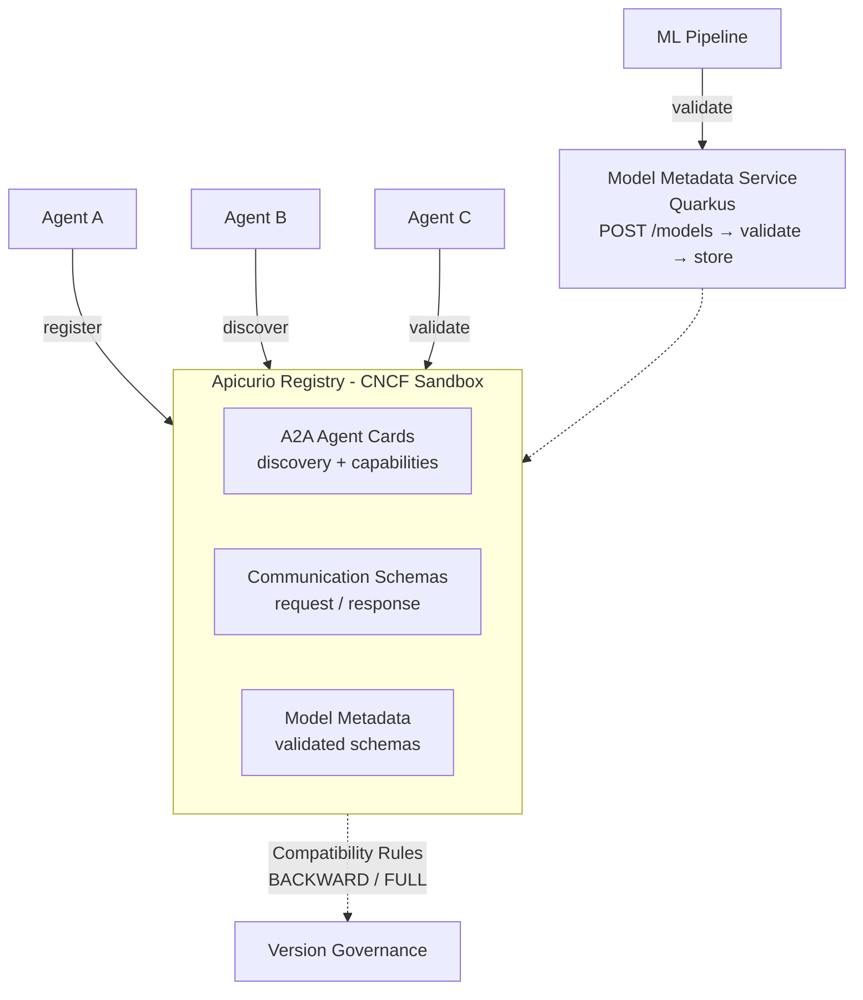

# Governing the Agent Swarm — Demo Walkthrough

This walkthrough accompanies the **governing-agent-swarm** talk. It demonstrates governance patterns for multi-agent AI systems using Apicurio Registry for agent discovery, communication contracts, and model metadata validation.

The model metadata validation service lives in the [model-metadata](model-metadata/) directory.

## Architecture



## Prerequisites

1. Docker
2. Java 21+ and Maven
3. `curl` and `jq`


## Step 1: Start the Infrastructure

```bash
# Start Apicurio Registry
docker run -d --name apicurio-registry \
  -p 8080:8080 \
  quay.io/apicurio/apicurio-registry:3.2.0

until curl -s http://localhost:8080/health | grep -q '"status":"UP"'; do sleep 2; done
echo "Registry ready"
```


## Step 2: Register AI Agents (A2A Discovery)

Register agents in the registry so they can discover each other:

```bash
# Register a Data Enrichment Agent
curl -X POST "http://localhost:8080/apis/registry/v3/groups/agents/artifacts" \
  -H "Content-Type: application/json" \
  -H "X-Registry-ArtifactId: data-enrichment-agent" \
  -H "X-Registry-ArtifactType: JSON" \
  -d '{
    "name": "Data Enrichment Agent",
    "description": "Enriches customer data with external sources",
    "url": "https://agents.internal/enrichment",
    "version": "1.0.0",
    "capabilities": {"streaming": true, "batchProcessing": true},
    "skills": [
      {"id": "enrich-customer", "name": "Customer Enrichment", "inputModes": ["json"], "outputModes": ["json"]},
      {"id": "enrich-address", "name": "Address Validation", "inputModes": ["json"], "outputModes": ["json"]}
    ]
  }'

# Register a Fraud Detection Agent
curl -X POST "http://localhost:8080/apis/registry/v3/groups/agents/artifacts" \
  -H "Content-Type: application/json" \
  -H "X-Registry-ArtifactId: fraud-detection-agent" \
  -H "X-Registry-ArtifactType: JSON" \
  -d '{
    "name": "Fraud Detection Agent",
    "description": "Analyzes transactions for fraud indicators",
    "url": "https://agents.internal/fraud",
    "version": "2.1.0",
    "capabilities": {"streaming": true, "realtime": true},
    "skills": [
      {"id": "score-transaction", "name": "Transaction Scoring", "inputModes": ["json"], "outputModes": ["json"]},
      {"id": "flag-account", "name": "Account Flagging", "inputModes": ["json"], "outputModes": ["json"]}
    ]
  }'

# Register a Summarization Agent
curl -X POST "http://localhost:8080/apis/registry/v3/groups/agents/artifacts" \
  -H "Content-Type: application/json" \
  -H "X-Registry-ArtifactId: summarization-agent" \
  -H "X-Registry-ArtifactType: JSON" \
  -d '{
    "name": "Summarization Agent",
    "description": "Generates summaries of text documents",
    "url": "https://agents.internal/summarizer",
    "version": "1.0.0",
    "capabilities": {"streaming": true},
    "skills": [
      {"id": "summarize", "name": "Text Summarization", "inputModes": ["text"], "outputModes": ["text"]}
    ]
  }'

echo "3 agents registered"
```

**Demo point:** Open the Registry UI at http://localhost:8080 and browse the `agents` group. Three agents, each with described capabilities and skills. This is agent discovery — any agent can query the registry to find peers.


## Step 3: Define Communication Contracts

Register schemas that define the communication protocol between agents:

```bash
# Request schema for the Fraud Detection Agent
curl -X POST "http://localhost:8080/apis/registry/v3/groups/agent-contracts/artifacts" \
  -H "Content-Type: application/json" \
  -H "X-Registry-ArtifactId: fraud-detection-request" \
  -H "X-Registry-ArtifactType: JSON" \
  -d '{
    "$schema": "https://json-schema.org/draft/2020-12/schema",
    "title": "FraudDetectionRequest",
    "type": "object",
    "required": ["transactionId", "amount", "currency", "customerId", "timestamp"],
    "properties": {
      "transactionId": {"type": "string"},
      "amount": {"type": "number", "minimum": 0},
      "currency": {"type": "string"},
      "customerId": {"type": "string"},
      "timestamp": {"type": "string", "format": "date-time"},
      "metadata": {"type": "object"}
    }
  }'

# Response schema for the Fraud Detection Agent
curl -X POST "http://localhost:8080/apis/registry/v3/groups/agent-contracts/artifacts" \
  -H "Content-Type: application/json" \
  -H "X-Registry-ArtifactId: fraud-detection-response" \
  -H "X-Registry-ArtifactType: JSON" \
  -d '{
    "$schema": "https://json-schema.org/draft/2020-12/schema",
    "title": "FraudDetectionResponse",
    "type": "object",
    "required": ["transactionId", "riskScore", "decision"],
    "properties": {
      "transactionId": {"type": "string"},
      "riskScore": {"type": "number", "minimum": 0, "maximum": 1},
      "decision": {"type": "string", "enum": ["APPROVE", "FLAG", "BLOCK"]},
      "reasons": {"type": "array", "items": {"type": "string"}}
    }
  }'

# Enable BACKWARD compatibility on both
curl -X POST "http://localhost:8080/apis/registry/v3/groups/agent-contracts/artifacts/fraud-detection-request/rules" \
  -H "Content-Type: application/json" \
  -d '{"ruleType": "COMPATIBILITY", "config": "BACKWARD"}'

curl -X POST "http://localhost:8080/apis/registry/v3/groups/agent-contracts/artifacts/fraud-detection-response/rules" \
  -H "Content-Type: application/json" \
  -d '{"ruleType": "COMPATIBILITY", "config": "BACKWARD"}'
```

**Demo point:** The request and response schemas define the contract between agents. With BACKWARD compatibility, the Fraud Detection Agent can add new optional fields to its response without breaking callers. This is the same pattern used for Kafka schemas — applied to agent-to-agent communication.


## Step 4: Model Metadata Governance

Start the model metadata validation service and demonstrate schema-driven model governance:

```bash
cd model-metadata

# Register the model metadata schema
curl -X POST "http://localhost:8080/apis/registry/v3/groups/mcp-models/artifacts" \
  -H "Content-Type: application/json" \
  -H "X-Registry-ArtifactId: model-context-schema" \
  -H "X-Registry-ArtifactType: JSON" \
  -d @model-context-schema.json

# Enable validation rules
curl -X POST "http://localhost:8080/apis/registry/v3/groups/mcp-models/artifacts/model-context-schema/rules" \
  -H "Content-Type: application/json" \
  -d @rule.json

# Start the validation service
mvn quarkus:dev -Dquarkus.http.port=8081
```

### Register a Valid Model

```bash
curl -X POST http://localhost:8081/models \
  -H "Content-Type: application/json" \
  -d @sample-model-contexts/valid-context.json | jq
```

Response:
```json
{"modelId": "customer-churn-predictor"}
```

### Reject an Invalid Model

```bash
curl -X POST http://localhost:8081/models \
  -H "Content-Type: application/json" \
  -d @sample-model-contexts/invalid-context.json | jq
```

Response:
```json
{
  "error": "Model validation failed",
  "details": [
    {"description": "$.artifactUri: integer found, string expected"},
    {"description": "$.metrics.accuracy: string found, number expected"},
    {"description": "$: required property 'version' not found"}
  ]
}
```

**Demo point:** The registry validates model metadata against the schema. Invalid submissions (wrong types, missing required fields) are rejected with detailed errors. This prevents broken model cards from entering your model registry or agent configuration.


## Step 5: Demonstrate Agent Versioning

Show what happens when an agent evolves:

```bash
# Update the Fraud Detection Agent to v3.0.0 (new capability)
curl -X POST "http://localhost:8080/apis/registry/v3/groups/agents/artifacts/fraud-detection-agent/versions" \
  -H "Content-Type: application/json" \
  -d '{
    "name": "Fraud Detection Agent",
    "description": "Analyzes transactions for fraud indicators with ML-based scoring",
    "url": "https://agents.internal/fraud",
    "version": "3.0.0",
    "capabilities": {"streaming": true, "realtime": true, "mlScoring": true},
    "skills": [
      {"id": "score-transaction", "name": "Transaction Scoring", "inputModes": ["json"], "outputModes": ["json"]},
      {"id": "flag-account", "name": "Account Flagging", "inputModes": ["json"], "outputModes": ["json"]},
      {"id": "explain-decision", "name": "Decision Explanation", "inputModes": ["json"], "outputModes": ["text"]}
    ]
  }'

# List all versions
curl -s "http://localhost:8080/apis/registry/v3/groups/agents/artifacts/fraud-detection-agent/versions" | jq
```

**Demo point:** The agent added a new skill (`explain-decision`) and a new capability (`mlScoring`). Version 2.1.0 is still accessible for agents that haven't migrated. This is the same version management that schema registries provide for data schemas — now applied to agent capabilities.


## Step 6: Agent Discovery Queries

```bash
# List all agents
curl -s "http://localhost:8080/apis/registry/v3/groups/agents/artifacts" | jq '.artifacts[].artifactId'

# Get a specific agent's capabilities
curl -s "http://localhost:8080/apis/registry/v3/groups/agents/artifacts/fraud-detection-agent/versions/latest/content" | jq

# Search agents by name
curl -s "http://localhost:8080/apis/registry/v3/search/artifacts?groupId=agents&name=Fraud" | jq
```


## Key Talking Points

1. **Agent sprawl = microservices sprawl** — The same governance crisis that hit microservices is hitting AI agents. Discovery, versioning, and contract management are unsolved problems. Schema registries already solve this.
2. **Three layers of governance:**
   - **Discovery:** A2A Agent Cards in the registry (who can do what)
   - **Contracts:** Request/response schemas with compatibility rules (how agents communicate)
   - **Metadata:** Model schemas validated at registration time (what models power the agents)
3. **A2A + MCP complementarity** — A2A handles agent-to-agent discovery and communication. MCP handles agent-to-tool integration. The registry governs both.
4. **BACKWARD compatibility prevents cascading failures** — When Agent A updates its response format, Agents B and C (which consume that response) continue to work because the registry enforces backward compatibility.
5. **CNCF sandbox** — Apicurio Registry brings cloud-native governance to the AI agent ecosystem.
